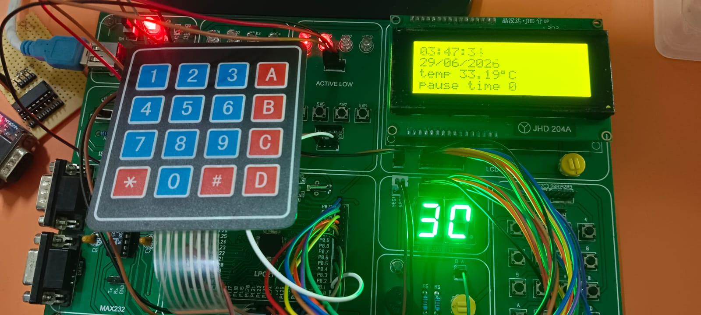
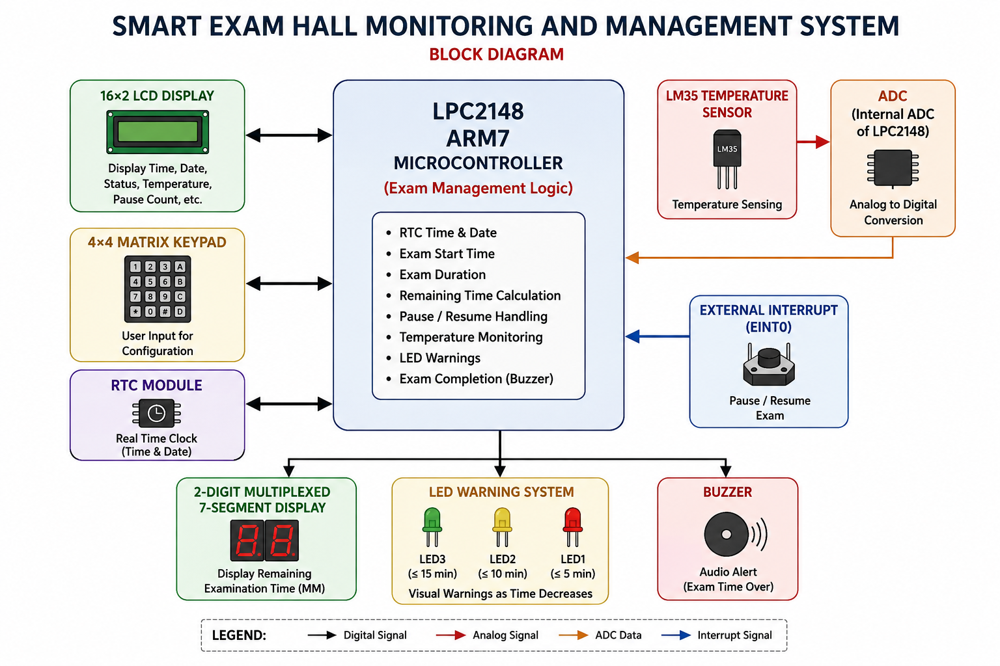
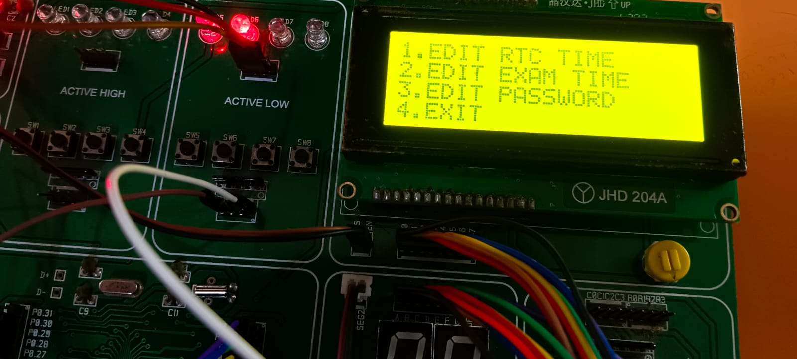
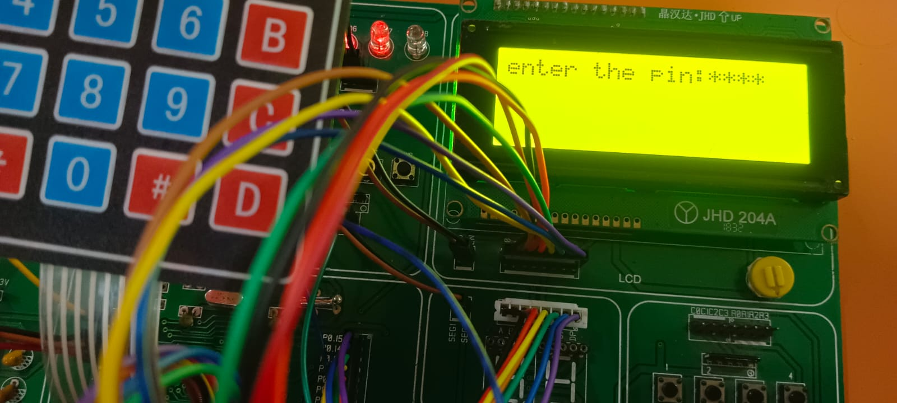

# 🚀 Smart Exam Hall Monitoring and Management System

### An ARM7-Based Embedded C Project for Automated Examination Hall Management

<p align="center">

**LPC2148 ARM7** • **Embedded C** • **RTC** • **ADC** • **External Interrupts**

</p>

---

## 📌 Project at a Glance

The **Smart Exam Hall Monitoring and Management System** is an embedded system developed using the **LPC2148 ARM7 microcontroller** to automate examination timing, monitoring, and alert management.

The system integrates **RTC, 16×2 LCD, 4×4 Matrix Keypad, LM35 temperature sensor, ADC, multiplexed 7-segment display, LEDs, buzzer, and external interrupts** to provide accurate examination timing, temperature monitoring, secure configuration, pause/resume functionality, and automatic examination completion alerts.

<p align="center">



</p>

---

## ✨ Key Features

- ⏰ RTC-based examination timing
- 🔐 Password-protected configuration
- 🔢 Configurable examination duration
- ⏱️ Real-time countdown using 7-segment display
- 🌡️ LM35-based temperature monitoring
- ⏸️ Pause / Resume using external interrupt
- 🚦 Time-based LED warning system
- 🔔 Buzzer alert when examination ends
- 📅 Automatic examination start and end time recording
- 🖥️ Real-time information displayed on LCD
---

## 📌 Project Overview

The **Smart Exam Hall Monitoring and Management System** is designed to make examination management more accurate, reliable, and user-friendly.

The system integrates an **RTC (Real-Time Clock), 16×2 LCD, 4×4 Matrix Keypad, LM35 temperature sensor, multiplexed 7-segment displays, LEDs, buzzer, and external interrupts** with the LPC2148 microcontroller.

Before an examination, the invigilator can securely configure the RTC, examination start time, and examination duration using a password-protected configuration mode. Once the examination starts, the system automatically manages the countdown and provides different alerts according to the remaining examination time.

The system also continuously monitors the examination hall temperature and records the examination start and end times using the RTC.

---

## 🎯 Objectives

The main objectives of this project are:

* Display the current RTC date and time on the LCD.
* Monitor and display the examination hall temperature.
* Configure examination duration using a 4×4 matrix keypad.
* Implement an automatic examination countdown timer.
* Display the remaining examination time using two multiplexed 7-segment displays.
* Provide Green, Yellow, and Red LED indications based on the remaining examination time.
* Provide password-protected access for configuration.
* Allow RTC date/time and examination settings to be modified securely.
* Implement Pause/Resume functionality using an external interrupt.
* Automatically record examination start and end times.
* Reduce manual timing errors and improve examination hall monitoring efficiency.

---

## 🧩 System Architecture

The LPC2148 ARM7 microcontroller acts as the central controller of the system.

### Inputs

* **RTC** – Provides current date and time.
* **4×4 Matrix Keypad** – Used for password entry and examination configuration.
* **Switch-1 / External Interrupt 0** – Used to enter the secured configuration mode.
* **Switch-2 / External Interrupt 1** – Used for Pause/Resume functionality.
* **LM35 Temperature Sensor** – Measures the examination hall temperature.

### Outputs

* **16×2 LCD** – Displays RTC time, temperature, and examination information.
* **Two Multiplexed 7-Segment Displays** – Display the remaining examination time.
* **Green LED** – Indicates more than 10 minutes remaining.
* **Yellow LED** – Indicates the final 10 minutes.
* **Red LED** – Indicates the final 1 minute.
* **Buzzer** – Indicates the completion of the examination.

---

## 📊 System Block Diagram

The following block diagram illustrates the complete architecture of the **Smart Exam Hall Monitoring and Management System**. The **LPC2148 ARM7 microcontroller** acts as the central controller and interfaces with the RTC, 4×4 matrix keypad, LM35 temperature sensor, ADC, external interrupts, LCD, multiplexed 7-segment display, LEDs, and buzzer.

<p align="center">
  
</p>

### 🔌 System Components

| Module | Function |
|---|---|
| **LPC2148 ARM7** | Central controller and exam management |
| **RTC** | Real-time date and time |
| **4×4 Matrix Keypad** | Password entry and configuration |
| **LM35 + ADC** | Temperature measurement |
| **16×2 LCD** | System information and status display |
| **2-Digit Multiplexed 7-Segment Display** | Remaining examination time |
| **External Interrupts** | Configuration and Pause/Resume control |
| **LED Warning System** | Examination time warnings |
| **Buzzer** | Examination completion alert |

---

## ⚙️ Hardware Requirements

| Component | Purpose |
|---|---|
| **LPC2148 ARM7 Microcontroller** | Main controller for the complete system |
| **16×2 LCD** | Displays RTC time, temperature, exam status, and remaining time |
| **4×4 Matrix Keypad** | Password entry and examination configuration |
| **RTC** | Provides real-time date and time |
| **LM35 Temperature Sensor** | Measures examination hall temperature |
| **ADC** | Converts the LM35 analog output into a digital value |
| **2-Digit Multiplexed 7-Segment Display** | Displays remaining examination time |
| **LEDs** | Provides time-based examination warnings |
| **Buzzer** | Provides an audible alert when the examination ends |
| **External Interrupt Switches** | Configuration and Pause/Resume control |
| **USB-UART Converter / DB-9 Cable** | Programming/communication interface |
| **Power Supply** | Provides required power to the system |

---

## 💻 Software & Development Tools

| Tool / Technology | Purpose |
|---|---|
| **Embedded C** | Application development |
| **LPC2148 ARM7** | Target microcontroller |
| **Keil µVision** | Embedded C development and compilation |
| **ARM7 Compiler / Toolchain** | Build and generate the microcontroller program |
| **Flash Magic** | Programming/flashing the LPC2148 |
| **GPIO Programming** | Digital input/output control |
| **ADC Programming** | LM35 temperature measurement |
| **RTC Programming** | Real-time clock management |
| **External Interrupts** | Configuration and Pause/Resume operations |
| **LCD Interfacing** | Display management |
| **Keypad Interfacing** | User input and configuration |
| **7-Segment Interfacing** | Remaining-time display |
| **VIC Interrupt Controller** | Interrupt management |
| **Register-Level Programming** | Direct microcontroller peripheral control |

---

# 🔄 System Working

## 1. Normal Monitoring Mode

When the system is powered on, it operates in normal monitoring mode.

The LCD continuously displays:

* Current date
* Current time
* Room temperature

The RTC provides the current date and time, while the LM35 sensor continuously measures the room temperature.

---

## 2. Secure Configuration Mode

The invigilator can enter configuration mode using **Switch-1**, which is connected to **External Interrupt 0**.

Before allowing any configuration changes, the system requests an administrator password through the 4×4 keypad.

### If the password is correct:

The invigilator can:

* Edit the RTC date.
* Edit the RTC time.
* Set the examination start time.
* Configure the examination duration.

### If the password is incorrect:

Access to the configuration mode is denied, and the system returns to normal monitoring mode.

---

# ⏱️ Examination Time Management

The examination timing is managed using the **RTC and an automatic countdown mechanism**.

Once the configured examination start time is reached, the system records the start time and begins the countdown automatically.

### Examination Timing Flow

```text
Configured Start Time
        │
        ▼
   RTC Time Match
        │
        ▼
 Examination Starts
        │
        ▼
 Record Start Time
        │
        ▼
 Start Countdown
        │
        ▼
 Display Remaining Time
        │
        ▼
 Time-Based LED Warning
        │
        ▼
 Remaining Time = 00
        │
        ▼
 Record End Time
        │
        ▼
    Buzzer Alert

---

# 🌡️ Temperature Monitoring

The system continuously monitors the examination hall temperature using an **LM35 temperature sensor**.

The LM35 produces an analog voltage corresponding to the measured temperature. The LPC2148 ADC converts this analog signal into a digital value, which is processed and displayed on the **16×2 LCD**.

## 🔄 Temperature Measurement Flow

```text
       LM35 Sensor
            │
            ▼
     Analog Voltage
            │
            ▼
       LPC2148 ADC
            │
            ▼
      ADC Conversion
            │
            ▼
 Temperature Calculation
            │
            ▼
        LCD Display
```

### 🌡️ Monitoring Benefits

- Continuous examination hall temperature monitoring
- Real-time temperature display on LCD
- ADC-based analog sensor interfacing
- Practical sensor-to-microcontroller interfacing

---

# ⏸️ Pause / Resume & Interrupt Handling

The system uses **external interrupts** to handle important examination control operations without continuously polling the switches.

## 🔌 External Interrupt 0 — Configuration

**Switch-1** is connected to **External Interrupt 0 (EINT0)**.

When the invigilator presses Switch-1, the system enters the secure configuration mode.

```text
Switch-1 Pressed
       │
       ▼
   EINT0 Triggered
       │
       ▼
Password Authentication
       │
   ┌───┴────┐
   │        │
Correct   Incorrect
   │        │
   ▼        ▼
Configuration   Return to
    Mode       Normal Mode
   │
   ▼
Configure RTC / Start Time /
Examination Duration
```

After successful authentication, the invigilator can configure:

- RTC date
- RTC time
- Examination start time
- Examination duration

## ⏸️ External Interrupt 1 — Pause / Resume

**Switch-2** is connected to **External Interrupt 1 (EINT1)**.

When Switch-2 is pressed during an examination, the countdown is paused. Pressing it again resumes the countdown from the point at which it was stopped.

```text
Switch-2 Pressed
       ↓
EINT1 Triggered
       ↓
Pause Countdown
       ↓
Press Again
       ↓
Resume Countdown
```

This functionality helps maintain accurate examination timing during unexpected interruptions or official announcements.

| Interrupt | Switch | Function |
|---|---|---|
| **EINT0** | Switch-1 | Secure configuration |
| **EINT1** | Switch-2 | Pause / Resume |

---

# 🛠️ Technologies & Concepts Used

### Microcontroller

* LPC2148
* ARM7 architecture

### Programming

* Embedded C

### Embedded Concepts

* GPIO interfacing
* LCD interfacing
* Matrix keypad interfacing
* 7-segment display interfacing
* ADC-based sensor interfacing
* RTC interfacing
* External interrupts
* Timer/countdown logic
* Multiplexing
* Embedded system state/control logic

### Sensors & Peripherals

* RTC
* LM35 temperature sensor
* LCD
* Keypad
* LEDs
* Buzzer
* 7-segment displays

---

# 📁 Project Structure

The repository contains the embedded application source files, header files, system architecture diagram, and project demonstration images.

```text
Smart-Exam-Hall-Monitoring-and-Management-System/
│
├── README.md
├── project.c
├── project.h
├── declaration.h
├── declaration_project.h
├── defination_project.c
├── Macros.h
├── system_architecture.png
├── configuration_menu.jpg
├── password_entry.jpg
└── live_monitoring.jpg
```

### File Overview

| File | Purpose |
|---|---|
| `project.c` | Main peripheral and application implementation |
| `project.h` | Project-related declarations |
| `declaration.h` | Peripheral/function declarations |
| `declaration_project.h` | Project and examination-management declarations |
| `defination_project.c` | Project/examination-management definitions |
| `Macros.h` | Macros and microcontroller-related definitions |
| `system_architecture.png` | System block diagram |
| `*.jpg` | Project demonstration and output photographs |
| `README.md` | Project documentation |

---

# 🧪 Testing Considerations

The project is intended to follow proper embedded software development practices and include complete test-case validation.

Important test scenarios include:

| Test Case              | Expected Result                       |
| ---------------------- | ------------------------------------- |
| Power ON               | System initializes correctly          |
| RTC operation          | Current date/time displayed           |
| Temperature sensor     | Temperature displayed on LCD          |
| Correct password       | Configuration mode is allowed         |
| Incorrect password     | Configuration access denied           |
| Examination start      | Countdown begins                      |
| More than 10 minutes   | Green LED active                      |
| Final 10 minutes       | Yellow LED active                     |
| Final 1 minute         | Red LED active                        |
| Countdown reaches 00   | Buzzer activates                      |
| Pause switch           | Countdown pauses                      |
| Resume switch          | Countdown continues from paused value |
| Examination completion | End time recorded                     |

The project requirements emphasize proper structure, naming conventions, modular design, and complete test-case validation.

---

# 🌟 Key Features

* ✅ LPC2148 ARM7-based embedded system
* ✅ RTC-based accurate examination timing
* ✅ Password-protected configuration
* ✅ Examination duration configuration
* ✅ Automatic countdown timer
* ✅ Dual 7-segment remaining-time display
* ✅ Real-time temperature monitoring
* ✅ Three-level LED examination alerts
* ✅ Examination completion buzzer
* ✅ External Interrupt 0 configuration control
* ✅ External Interrupt 1 Pause/Resume control
* ✅ Automatic examination start/end time recording
* ✅ Modular embedded-system design

---

# 🎓 Learning Outcomes

This project provides practical experience in:

* Embedded C programming
* ARM7/LPC2148 microcontroller programming
* Peripheral interfacing
* RTC-based time management
* LCD and keypad interfacing
* ADC and temperature sensor interfacing
* 7-segment multiplexing
* External interrupt handling
* Timer and countdown implementation
* Embedded system debugging and testing
* Modular and structured embedded software development

---

# 🚀 Applications

The concept can be adapted for:

* Educational institutions
* Examination halls
* Training centers
* Certification/testing centers
* Automated classroom timing systems
* Other environments requiring controlled timing and status indication

---

# 🔮 Future Improvements

Possible future enhancements could include:

* Centralized monitoring of multiple examination halls
* Data storage for examination records
* PC/mobile-based monitoring
* Network connectivity
* Automatic report generation
* Additional environmental sensors
* Real-time remote notifications

> These are potential extensions and are **not part of the current implementation described in the project document**.

---

# 📷 Project Demonstration

The following photographs show the implemented hardware and different operating modes of the **Smart Exam Hall Monitoring and Management System**.

## 🧩 Configuration & System Architecture

The system architecture is shown above in the **System Block Diagram** section. The photographs below demonstrate the implemented configuration and monitoring interfaces.

## 🔐 Configuration & Password Authentication

<p align="center">
  
  &nbsp;&nbsp;&nbsp;
  
</p>

The system provides a **password-protected configuration mode**. The administrator can securely access examination settings through the 4×4 matrix keypad.

Configuration includes:

- RTC date and time
- Examination start time
- Examination duration
- Password-protected access

---

## ⏱️ Live Examination Monitoring

<p align="center">
  
</p>

During the examination, the system provides real-time monitoring through the LCD and 7-segment display, including:

- Current RTC time
- Room temperature
- Remaining examination time
- Examination status

---

## 🧰 Hardware Implementation

The hardware implementation integrates the **LPC2148 ARM7 controller, LCD, keypad, RTC, LM35 temperature sensor, 7-segment display, LEDs, switches, and buzzer** into a single examination monitoring system.
---

# 📚 Project Documentation

The project documentation contains the complete aim, objectives, hardware/software requirements, system architecture, workflow, and operating sequence.

---

## 👨‍💻 Author

### Sukumar Yarramsetti

**B.Tech – Electronics and Communication Engineering**  
**Embedded Systems**

---

## ⭐ Project Summary

The **Smart Exam Hall Monitoring and Management System** demonstrates how an ARM7-based embedded system can combine **real-time clock management, countdown timing, temperature monitoring, user authentication, interrupt handling, visual indicators, and automatic event logging** into a single practical application.

By reducing dependence on manual timing and monitoring, the system provides a reliable and cost-effective approach to examination hall management.

---
